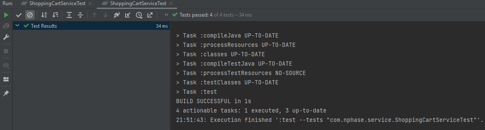

# Shopping Cart Service

This project implements a shopping cart service that calculates the total price of a shopping cart with various discount policies. Users can add products to their shopping cart and the service will handle bulk discounts and category-based discounts.

# My changes 

I added two functions to calculate discounts, then parameterized the project by adding the DiscountPolicy class.

Then I added 4 tests to check the working without discounts, with one of the 2 discounts, with second of the 2 discounts, then with 2 discounts at once.

# Results

